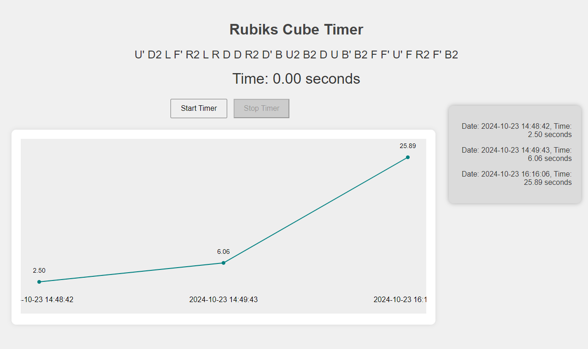

# Rubiks Cube Timer App

## Beskrivning

Rubiks Cube Timer App är en webbaserad applikation som hjälper dig att mäta tiden det tar att lösa en Rubiks kub. Appen inkluderar en slumpmässig sekvensgenerator som genererar en ny sekvens varje gång timern stoppas, vilket gör att du alltid får en ny utmaning. Resultaten sparas lokalt i webbläsaren och visualiseras i ett linjediagram för att följa dina framsteg.

## Funktioner

- **Start och stoppa timer:** Starta timern för att mäta tiden det tar att lösa kuben och stoppa den när du är klar.
- **Slumpmässig sekvens:** Genererar en ny slumpmässig blandningssekvens på 25 drag varje gång timern stoppas.
- **Resultathantering:** Sparar dina tider lokalt med hjälp av localStorage.
- **Visualisering av resultat:** Visar dina tider som ett linjediagram för att enkelt se dina framsteg över tid.

## Installation och körning

För att köra appen lokalt, följ dessa steg:
1. Klona eller ladda ner detta repository.
2. Kör `npm i` i din terminal
3. Kör `npm run dev` för att starta en localhost via vite

Appen är enkel och behöver ingen server för att köras. All kod körs i webbläsaren.

## Filstruktur

- `/src/app.js` - Huvudfilen som hanterar logiken för timern, resultat och sekvensgenerering.
- `/src/components/Timer.js` - En komponent som hanterar tidtagningen.
- `/src/components/DataStorage.js` - Komponent för att spara och hämta resultat från localStorage.
- `/src/components/Results.js` - Hanterar visning av resultat på sidan.
- `/src/components/ShuffleSequence.js` - Komponent för att generera en slumpmässig sekvens av kubdrag.
- `/src/charts/ChartLibrary.js och /src/charts/LineChart.js` - Komponenter för att skapa linjediagram för visualisering av resultat.
- `/index.html` - Huvud-HTML-filen som används för att visa gränssnittet.
- `/src/styles/main.css` - CSS för att styla applikationen.

## Användning
1. Öppna applikationen i din webbläsare.
2. Blanda din kub enligt blandningssekvensen under rubriken
3. Klicka på **Start Timer**-knappen för att börja mäta tiden för din Rubiks kub-lösning.
4. Klicka på **Stop Timer** när du är klar. Tiden sparas, och en ny slumpmässig sekvens genereras.
5. Ditt resultat visas till höger, och ett linjediagram uppdateras med dina nya tider.

## Krav
- En modern webbläsare (t.ex. Chrome, Firefox, Safari, Edge).

## Teknologier
- **JavaScript**: För logiken i appen.
- **HTML/CSS**: För att bygga och styla användargränssnittet.
- **localStorage**: För att spara resultat lokalt i användarens webbläsare.

## Framtida Förbättringar
- Möjlighet att radera enskilda resultat.
- Möjlighet att spara och synka resultat via molnet.
- Förbättrad visualisering med fler diagramtyper.


*Bild på applikationen*

---
---
---
---

# Dokumentation för ChartLibrary

Denna dokumentation beskriver hur du använder klasserna `BarChart` och `LineChart` för att generera stapel- och linjediagram med hjälp av SVG. Vi går igenom koden och visar exempel på hur klasserna kan användas.

## Innehåll
1. [BarChart.js - Förklaring och användning](#barchart)
2. [LineChart.js - Förklaring och användning](#linechart)
3. [ChartLibrary - Exempel på användning](#chartlibrary)

<a name="barchart"></a>
## BarChart.js - Förklaring och användning

I `BarChart.js` skapas stapeldiagram med SVG där varje stapel representerar ett datapunkt (label, value).

### Viktiga funktioner i BarChart:
- **`createElementNS`**: Används för att skapa SVG-element i rätt namnrymd (namespace), vilket är nödvändigt för att kunna använda SVG i HTML-dokument.
- **Placering av staplar**: Staplarnas position beräknas baserat på deras index i datamängden och deras värde. `x`- och `y`-attributen styr placeringen i diagrammet.
- **Textetiketter**: Etiketter visas under varje stapel genom `<text>`-element, och med hjälp av `text-anchor: middle` placeras texten centrerad under stapeln.

### Exempel på användning:

```javascript
const data = [
    {"label": "January", "value": 40},
    {"label": "February", "value": 25},
    {"label": "March", "value": 35}
]

const chart = new BarChart(data)
document.body.innerHTML = chart.render()
```

<a name="linechart"></a>
## LineChart.js - Förklaring och användning
I LineChart.js skapas linjediagram där datapunkterna kopplas samman med en linje. Varje punkt markeras med en cirkel och en etikett.

### Viktiga funktioner i LineChart:
- *`Polyline`*: Ett <polyline>-element används för att skapa linjen som kopplar samman datapunkterna. En sträng med koordinater (x, y) skickas till polyline för att rita linjen.
- *`Cirklar vid punkterna`*: Varje datapunkt markeras med en liten cirkel för att tydligt visa var punkterna är placerade.
- *`Textetiketter`*: Textetiketter placeras under varje datapunkt, precis som i stapeldiagrammet, för att visa vilken label som hör till varje punkt.

### Exempel på användning:
```javascript
const data = [
    {"label": "January", "value": 40},
    {"label": "February", "value": 25},
    {"label": "March", "value": 35}
]

const chart = new LineChart(data)
document.body.innerHTML = chart.render()
```
I detta exempel skapas ett linjediagram som kopplar samman datapunkterna med en linje.

<a name="chartlibrary"></a>

## ChartLibrary - Exempel på användning
ChartLibrary är en klass som förenklar genereringen av både stapel- och linjediagram. Den hanterar skapandet av diagram baserat på vilken typ du vill visa.

### Exempel på att generera diagram med ChartLibrary:
```javascript
import { ChartLibrary } from '../src/ChartLibrary.js'

const data = [
    { label: "January", value: 40 },
    { label: "February", value: 25 },
    { label: "March", value: 35 },
    { label: "April", value: 50 },
    { label: "May", value: 5 },
    { label: "June", value: 15 },
    { label: "July", value: 45 },
    { label: "August", value: 10 },
    { label: "September", value: 35 }
]

const charts = new ChartLibrary()

// Generera stapeldiagram
const barChart = charts.createBarChart(data)
const chartContainer = document.createElement('div')
chartContainer.innerHTML = barChart
document.body.appendChild(chartContainer)

// Generera linjediagram
const lineChart = charts.createLineChart(data)
const lineChartContainer = document.createElement('div')
lineChartContainer.innerHTML = lineChart
document.body.appendChild(lineChartContainer)
```
I detta exempel används ChartLibrary för att generera och rendera både ett stapel- och linjediagram baserat på samma datamängd.

-------------------------------

## Ytterligare förbättringar:
PieChart: En funktion för att skapa cirkeldiagram (PieChart) är under utveckling och kommer att läggas till i framtiden.

