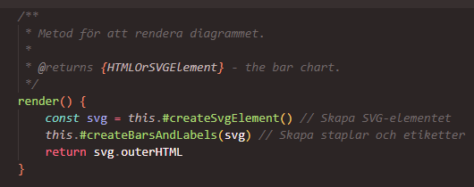
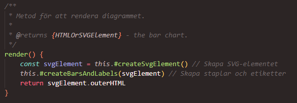
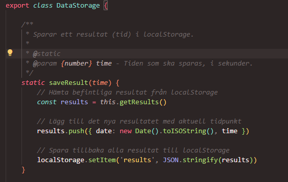
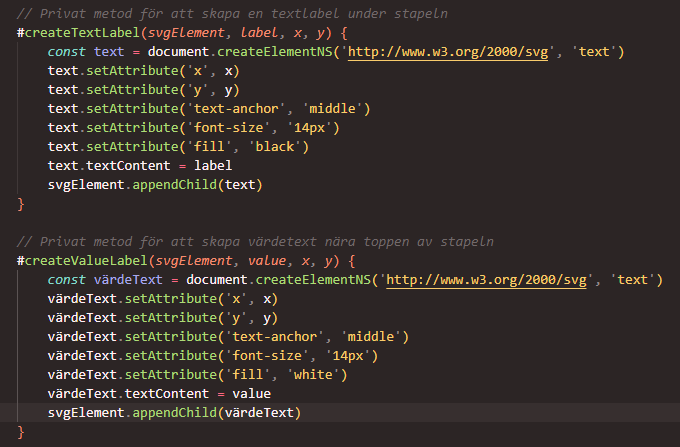
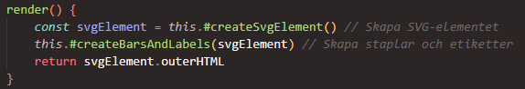
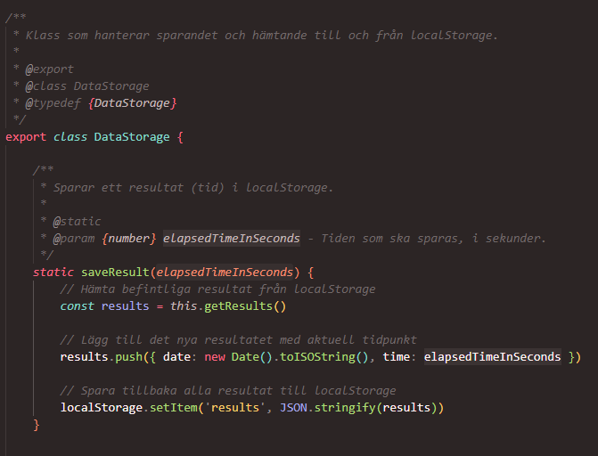

# Clean Code Analysis

## Chapter 2: Meaningful Names

Thething that I found fixable the most from the chapter was 'Use Intention-Revealing Names'. There were a couple instances where even I upon coming back to the code had trouble figuring out exactly what they did because I was not clear enough. Here are two examples:

I changes the name of the variable `svg` to `svgElement` to make it clearer that the variable represented an element. It could be easy to think "svg" was short for something without the context.

I changed the name from `time` to `elapsedTimeInSeconds` here. Time doesn't say much about what it is and even less when it is a parameter for a method. 

## Chapter 3: Functions

I feel like my functions were okay according to the book. Fairly short with descriptive names, and they mostly only do one thing. Though one thing I can find, that might make my code better quality is what the book calls `Argument Objects`. For example in instances like this:

As for now I haven't changed it, but that is a possible improvment of the code.

## Chapter 4: Comments

I feel like my comments are mostly good. Examples from book:

### TODO Comments

I could find a couple of "Bad Comments" though, that I removed. Example:

*These comments does not explain anything that the names of the methods does not*

Also found a bit of noise comments here and there:

## Chapter 5: Formatting

The principles from this chapter helped me improve the readability and overall structure of my code. I made the following adjustments:

1. **Consistent Indentation and Spacing:** I ensured that all blocks of code, including methods and loops, have consistent indentation for better readability.

* For example, in the `#createBarsAndLabels` method, I added clear spacing between logical sections (creating bars, text labels, and value labels).
* Improved readability by limiting lines to around 80–100 characters wherever possible.

2. Logical Grouping of Code: I grouped related methods together. For instance, in the `BarChart` class, all private helper methods related to rendering (e.g., `#createBar`, `#createTextLabel`) are placed together, making it easier to navigate the code.

3. Vertical Spacing: Added blank lines between unrelated code blocks, particularly in larger methods like `#createBarsAndLabels` and `addResultsToContainer`. This ensures that code "breathes" and is visually appealing.

## Chapter 6: Objects and Data Structures

This chapter highlighted the importance of encapsulation and the trade-offs between objects and data structures. I applied the following insights:

1. **Encapsulation:** I ensured that my classes use private methods (`#methodName`) and attributes where possible. For example, in the `BarChart` class, the rendering logic is hidden inside private methods (`#createBar`, `#createTextLabel`) to prevent external code from accessing or modifying internal details.

2. **Data Abstraction:** The `ShuffleSequence` class demonstrates good data abstraction by hiding the details of how the shuffle sequence is generated. The user interacts with a single method (`generateSequence`) without needing to know the internal logic.

3. **Trade-Offs:** I noticed that my DataStorage class is more of a data structure than an object since it exposes raw data via the getResults method. While this is acceptable for its purpose, it might be worth refactoring to provide higher-level operations on the data instead.

## Chapter 7: Error Handling

This chapter encouraged me to think about how my code manages and reports errors. Key improvements include:

1. **Use of Exceptions:** I ensured that exceptions are used to handle unexpected conditions rather than relying on return codes. For instance, I added a check in `DataStorage.getResults` to handle cases where data might be corrupted in `localStorage`.

2. **Fail Fast:** In methods like `#createBar` and `#createTextLabel`, I added checks for invalid inputs (e.g., missing or incorrect attributes). This ensures that errors are caught early rather than leading to subtle bugs.

3. **Clear Error Messages:** If an error occurs (e.g., invalid data passed to the chart methods), the app logs meaningful error messages to help with debugging.

## Chapter 8: Boundaries

This chapter helped me understand the importance of clean interfaces and careful use of external libraries. Insights applied:

1. **Decoupling:** My `ChartLibrary` class provides a clear boundary between the app and the charting functionality. This decoupling ensures that the charting module can be replaced or extended without impacting the rest of the app.

2. **Exploration with Third-Party Tools:** While I didn’t use any third-party libraries for charting (like D3.js), this chapter reinforced the idea of wrapping such libraries in adapter classes if they were to be introduced in the future.

## Chapter 9: Unit Tests

This chapter emphasized the importance of thorough and meaningful testing. Reflections:

**Test Coverage:** I have implemented automated tests for the core functionality of the application, including classes like Timer, DataStorage, and ShuffleSequence. However, I encountered challenges testing components that rely on web APIs, such as document and localStorage, in the Node.js test environment. To address this, I integrated tools like jsdom and node-localstorage to simulate a browser-like environment for my tests.

**Small, Focused Tests:** I focused on writing small, targeted tests for individual components. For instance, the Timer class has tests to ensure accurate time calculations for startTimer, stopTimer, and getCurrentTime. Similarly, the ShuffleSequence tests verify that a sequence of exactly 25 valid moves is generated.

**Testing Edge Cases:** Inspired by this chapter, I added tests to cover edge cases, such as handling empty datasets when generating charts and ensuring localStorage can handle missing or corrupted data. I also identified the need to improve error handling for unsupported scenarios, such as negative values in charts, which will require further development.

**Integration Challenges:** While testing methods that interact with the DOM (e.g., BarChart.render) proved more complex, tools like jsdom enabled me to validate the structure of generated SVG elements, ensuring that they are correctly formed and rendered.

## Chapter 10: Classes

This chapter reinforced the importance of designing small, cohesive classes with a single responsibility. Improvements:

1. **Small Classes:** Each class in my project has a distinct purpose. For example:
* `BarChart` handles rendering of bar charts.
* `DataStorage` manages interaction with `localStorage`.
* `Timer` encapsulates timer logic.
None of these classes have overlapping responsibilities, which aligns with the Single Responsibility Principle (SRP).

2. **Low Coupling:** I ensured that my classes interact through well-defined interfaces. For example, the app interacts with `ChartLibrary` and not directly with individual chart types.

## Chapter 11: Systems

This chapter provided insights into how to design systems that are easy to develop and maintain over time. Key takeaways:

1. `Separation of Concerns:` My project separates the app logic from the charting logic. The app handles user interaction, while ChartLibrary focuses solely on creating charts.

2. **Simplicity:** I avoided adding unnecessary features or complexity. For instance, while `createPieChart` is marked as TODO, I decided not to implement it prematurely to keep the system focused on current requirements.

3. **Iterative Development:** By focusing on small, incremental improvements (e.g., implementing `BarChart` first, then `LineChart`), I was able to ensure that each feature worked correctly before moving to the next.