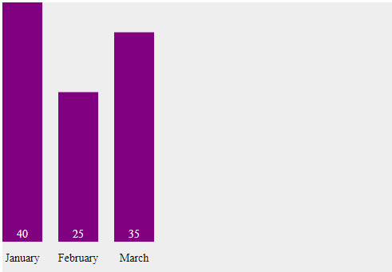
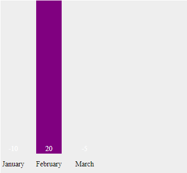
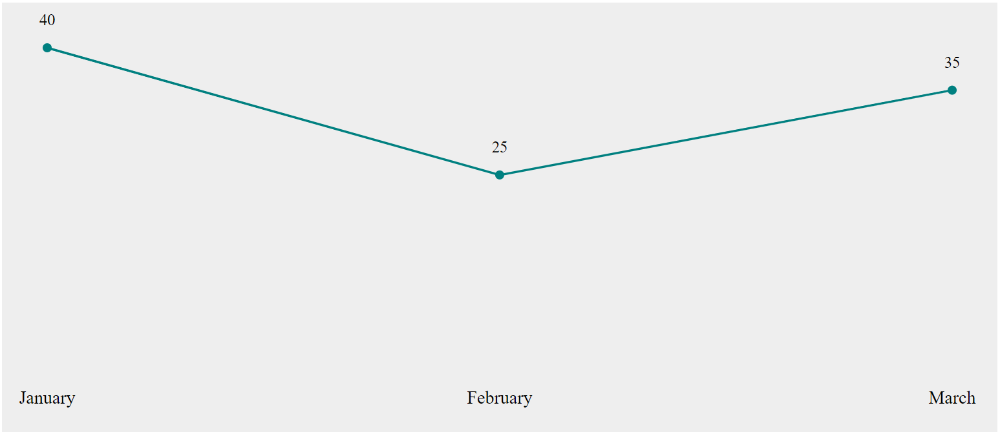
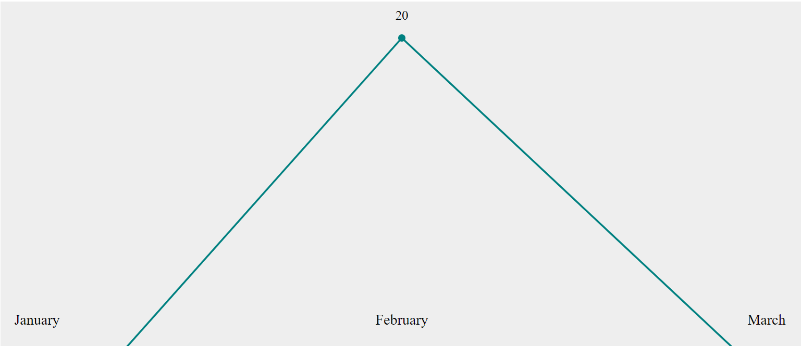

# Testrapport för Graph/Chart Library

## 1. Sammanfattning
Denna rapport sammanfattar testningen av Graph/Chart Library, som implementerar stapeldiagram, linjediagram och cirkeldiagram. Testningen har genomförts med en rad olika dataset och fokuserade på att verifiera korrekt rendering av diagram, felhantering vid ogiltig data och prestanda vid större dataset. Resultaten visar att biblioteket fungerar korrekt i de flesta fall, men vissa buggar identifierades i hanteringen av negativa värden.

## 2. Testplan
### Testmål
Testmålet var att verifiera att Graph/Chart Library fungerar som förväntat när det används för att skapa stapeldiagram, linjediagram och cirkeldiagram.

### Teststrategi
Teststrategin inkluderade funktionstester för att säkerställa att varje diagram renderas korrekt, gränsvärdestester för att testa hantering av ogiltiga data, samt prestandatester med stora dataset.

## 3. Testmiljö
Tester genomfördes på följande miljö:
- Operativsystem: Windows 11
- Webbläsare: Chrome v91
- Node.js version: 16.3.0

## 4. Testfall
### Testfall TC01: Verifiera att stapeldiagram skapas korrekt
- **Beskrivning**: Testa om ett stapeldiagram genereras korrekt med giltig data.
- **Indata**:
  ```json
  [
    {"label": "January", "value": 40},
    {"label": "February", "value": 25},
    {"label": "March", "value": 35}
  ]
  ```
- **Förväntat resultat**: Stapeldiagrammet ska visa tre staplar med värdena 40, 25 och 35.
- **Utfört resultat**: Stapeldiagrammet genererades korrekt med alla tre staplarna.
- **Status**: Pass

### Testfall TC02: Hantering av negativa värden i stapeldiagram
**Testfall TC02**: Hantering av negativa värden i stapeldiagram.
- **Beskrivning**: Testa hur stapeldiagrammet hanterar negativa värden i datan.
- **Indata**:
  ```json
  [
    {"label": "January", "value": -10},
    {"label": "February", "value": 20},
    {"label": "March", "value": -5}
  ]
  ```
- **Förväntat resultat**: Stapeldiagrammet ska hantera negativa värden korrekt (antingen genom att visa negativa staplar eller genom ett felmeddelande).
- **Utfört resultat**: Diagrammet visade felaktiga negativa staplar som gick utanför diagrammets y-axel.
- **Status**: Fail

### Testfall TC03: Verifiera att linjediagram skapas korrekt
- **Beskrivning**: Testa om ett linjediagram genereras korrekt med giltig data.
- **Indata**:
  ```json
  [
    {"label": "January", "value": 40},
    {"label": "February", "value": 25},
    {"label": "March", "value": 35}
  ]
  ```
- **Förväntat resultat**: Linjediagrammet ska visa tre staplar med värdena 40, 25 och 35.
- **Utfört resultat**: Linjediagrammet genererades korrekt med alla tre staplarna.
- **Status**: Pass

### Testfall TC04: Hantering av negativa värden i linjediagram
**Testfall TC02**: Hantering av negativa värden i linjediagram.
- **Beskrivning**: Testa hur linjediagrammet hanterar negativa värden i datan.
- **Indata**:
  ```json
  [
    {"label": "January", "value": -10},
    {"label": "February", "value": 20},
    {"label": "March", "value": -5}
  ]
  ```
- **Förväntat resultat**: Stapeldiagrammet ska hantera negativa värden korrekt (antingen genom att visa negativa staplar eller genom ett felmeddelande).
- **Utfört resultat**: Diagrammet visade felaktiga negativa staplar som gick utanför diagrammets y-axel.
- **Status**: Fail

## 5. Sammanfattning av Testresultat
Sammanfattningsvis klarade biblioteket 1 av 2 testfall. Funktionaliteten för att skapa stapeldiagram och linjediagram fungerade som förväntat med giltiga data. Ett testfall misslyckades, relaterat till hanteringen av negativa värden. Dessa buggar bör åtgärdas innan biblioteket är redo för användning i produktionsmiljö.

## 6. Slutsatser och Rekommendationer
Testerna visar att Graph/Chart Library är funktionellt och presterar bra med giltig data. Dock identifierades vissa brister i hanteringen av negativa värden, vilket kräver vidare felsökning och åtgärd. Efter att dessa buggar har åtgärdats, bedöms biblioteket vara redo för användning.

## 7. Bilagor

### Testfall TC01: Verifiera att stapeldiagram skapas korrekt


### Testfall TC02: Hantering av negativa värden i stapeldiagram


### Testfall TC03: Verifiera att linjediagram skapas korrekt


### Testfall TC04: Hantering av negativa värden i linjediagram
